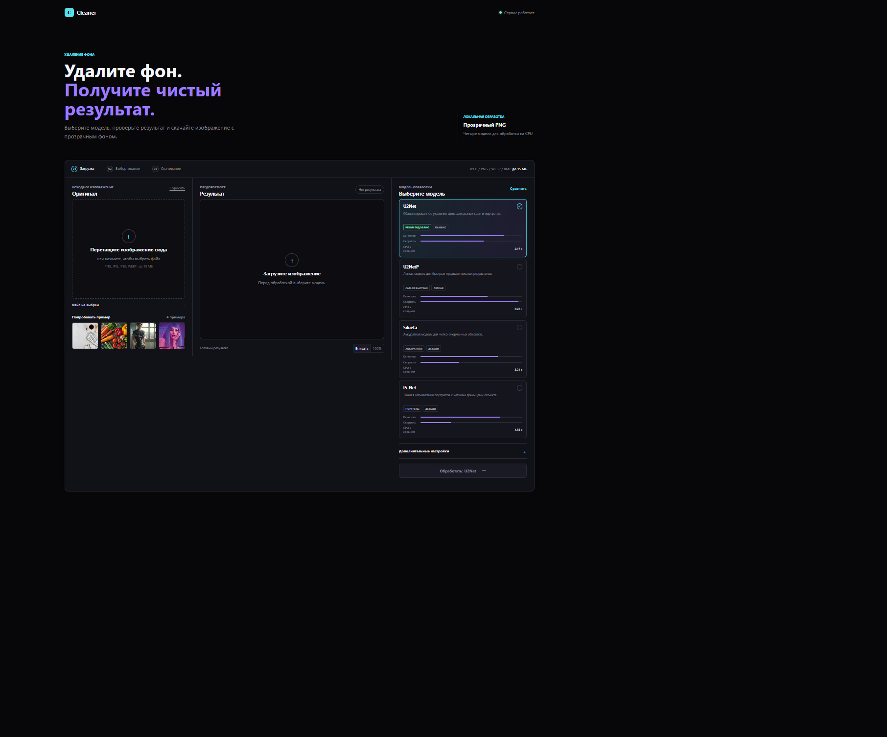
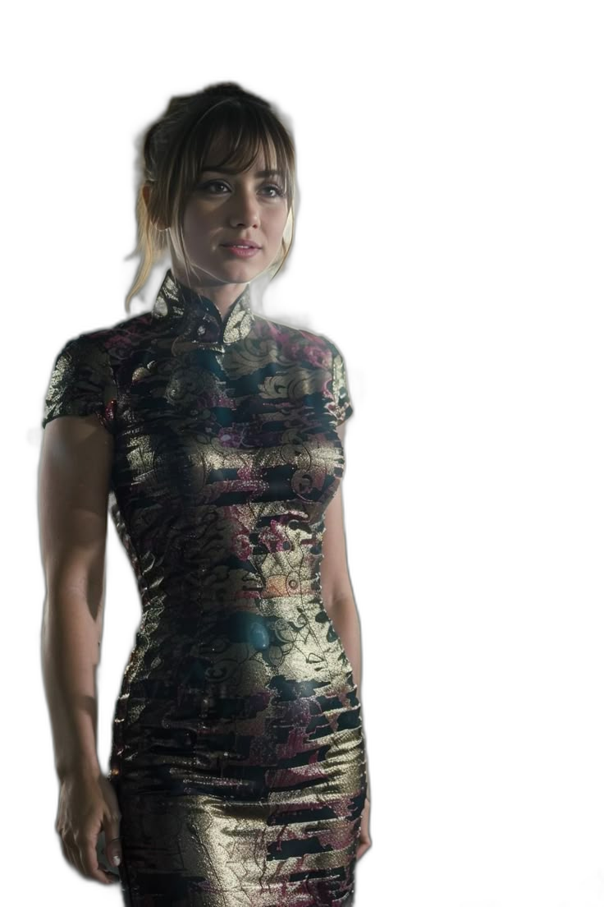

# Cleaner

Веб-сервис для удаления фона с фото. Интерфейс Cleaner доступен на корневом адресе, API использует `rembg` + ONNX-модель `u2net`.

Исследование и локальный бенчмарк: [docs/research.md](docs/research.md).

Актуальные фото для тестов лежат в `benchmark/images`. Актуальные результаты бенчмарка лежат в `benchmark/results/current`:

- `summary.json` — метрики по моделям и изображениям;
- `contact_sheet.jpg` — визуальное сравнение;
- `*.png` — результаты удаления фона;
- `*_preview.jpg` — preview на шахматном фоне.

## Запуск

```bash
python -m venv .venv
.venv\Scripts\activate
pip install -r requirements\requirements-base.txt   
uvicorn main:app --reload
```

Сервис и интерфейс Cleaner будут доступны на http://127.0.0.1:8000.

Интерфейс поддерживает выбор доступной локальной модели (`u2net`, `u2netp`, `silueta`, `isnet-general-use`), before/after preview, запуск сравнения моделей и экспорт PNG, WebP или JPG в браузере.

## Docker

Сервис можно запустить в Docker без установки Python-зависимостей на хост-систему.

Сборка Docker-образа:

```bash
docker build -t cleaner .
docker run --rm -p 8000:8000 cleaner
```

После запуска сервис и интерфейс Cleaner доступны по адресу: http://127.0.0.1:8000/

Проверка health endpoint: http://127.0.0.1:8000/api/health

Для остановки контейнера нажмите Ctrl+C.

## API

```bash
curl -X POST "http://127.0.0.1:8000/api/remove-background" ^
  -F "file=@photo.jpg" ^
  -o result.png
```

Поддерживаются JPEG, PNG, WEBP и BMP до 15 MB. Ответ возвращается как PNG с прозрачностью.

Дополнительные поля:

- `model_name` - модель из списка доступных, по умолчанию `u2net`;
- `alpha_matting` - включить alpha matting;
- `post_process_mask` - включить постобработку маски;
- `foreground_threshold` и `background_threshold` - пороги от 0 до 255.

## Бенчмарк

```bash
python benchmark/run_benchmark.py
```

По умолчанию скрипт проверяет локальные CPU-модели `u2netp`, `silueta`, `u2net` и `isnet-general-use`. Для явного воспроизводимого прогона можно указать модели так:

```bash
python benchmark/run_benchmark.py --models u2netp silueta u2net isnet-general-use
```

## Тесты

```bash
pip install -r requirements-dev.txt
pytest
```

### Интерфейс



### Результат удаления фона

| Исходное изображение | Результат |
|:---:|:---:|
|  |  |